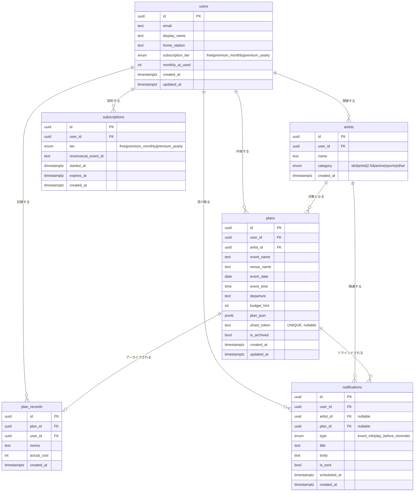

# OshiPlan 要件定義書

推し活遠征プランナーアプリ

2026年5月 / Version 1.0 (MVP)

---

## 1. 機能要件

### 1.1 認証・ユーザー管理

| # | 機能 | 説明 | MVP |
|---|------|------|-----|
| F-01 | メール認証 | メールアドレス＋パスワードで登録・ログイン | ✅ |
| F-02 | ソーシャルログイン | Apple / Google アカウントでログイン | ✅ |
| F-03 | プロフィール設定 | 表示名・最寄り駅の登録・変更 | ✅ |
| F-04 | アカウント削除 | ユーザーデータの完全削除（法令対応） | ✅ |
| F-05 | セッション管理 | JWTをセキュアストアで保持、自動更新 | ✅ |

### 1.2 推し管理

| # | 機能 | 説明 | MVP |
|---|------|------|-----|
| F-10 | 推し登録 | 名前・カテゴリを入力して推しを登録 | ✅ |
| F-11 | 推し一覧 | 登録した推しの一覧表示 | ✅ |
| F-12 | 推し編集・削除 | 登録情報の変更・削除 | ✅ |

カテゴリ選択肢：`idol` / `artist` / `2.5d` / `anime` / `sports` / `other`

### 1.3 AI遠征プラン生成（コア機能）

| # | 機能 | 説明 | MVP |
|---|------|------|-----|
| F-20 | 公演情報入力 | 公演名・会場名・日時を入力 | ✅ |
| F-21 | 出発地・予算入力 | 最寄り駅（デフォルト：ユーザー設定）と予算の上限 | ✅ |
| F-22 | オプション設定 | 宿泊有無・物販有無・聖地巡礼有無 | ✅ |
| F-23 | AI自動生成 | Claude APIが交通・宿・物販・食事・聖地を含む行程を生成 | ✅ |
| F-24 | 生成結果の表示 | 行程タイムライン・地図・概算費用を表示 | ✅ |
| F-25 | 生成結果の手動編集 | 行程・宿・交通手段の変更 | ✅ |
| F-26 | 利用枠管理 | Free: 月3回まで / Premium: 実質無制限（日100回上限） | ✅ |

### 1.4 プラン管理

| # | 機能 | 説明 | MVP |
|---|------|------|-----|
| F-30 | プラン保存 | 生成したプランをDBに保存 | ✅ |
| F-31 | プラン一覧 | 未来・過去のプランを一覧表示 | ✅ |
| F-32 | プラン詳細 | 行程・地図・宿・物販タイム・費用を表示 | ✅ |
| F-33 | プラン編集 | 保存済みプランの内容変更 | ✅ |
| F-34 | プラン削除 | プランの削除 | ✅ |
| F-35 | 共有リンク発行 | `share_token` によるURL生成、認証不要で閲覧可能 | ✅ |
| F-36 | 共有プラン閲覧 | トークン付きURLから読み取り専用で表示 | ✅ |
| F-37 | オフライン表示 | 直近プランをローカルキャッシュに保持 | ✅ |

### 1.5 遠征記録（アーカイブ）

| # | 機能 | 説明 | MVP |
|---|------|------|-----|
| F-40 | 遠征記録登録 | 過去プランにメモ・実費を追記 | v1.2 |
| F-41 | 年間サマリ | 参戦数・総遠征費・訪問会場を可視化 | v1.2 |

### 1.6 プッシュ通知

| # | 機能 | 説明 | MVP |
|---|------|------|-----|
| F-50 | 公演情報通知 | 登録した推しの公演情報を自動通知 | v1.1 |
| F-51 | 前日リマインダー | 遠征前日に「明日は○○公演です」と通知 | v1.1 |

### 1.7 サブスクリプション・課金

| # | 機能 | 説明 | MVP |
|---|------|------|-----|
| F-60 | プラン加入 | RevenueCat経由でPremium（月額 / 年額）を購入 | ✅ |
| F-61 | プラン解約 | ストアから解約（自動で期限切れ） | ✅ |
| F-62 | Webhook受信 | RevenueCatからの課金イベントを受け取り、DBを更新 | ✅ |
| F-63 | 無料枠リセット | 毎月1日に `monthly_ai_used` を0にリセット | ✅ |

---

## 2. 非機能要件

### 2.1 性能

| 項目 | 要件 |
|------|------|
| AIプラン生成 | 10秒以内（タイムアウト時はエラーメッセージ表示） |
| 画面遷移 | 1秒以内 |
| API応答（生成以外） | 500ms以内（p95） |

### 2.2 可用性・信頼性

| 項目 | 要件 |
|------|------|
| 月次稼働率 | 99%以上（個人開発レベル） |
| クリティカル障害検知 | Sentryからメール即時通知（決済不能・ログイン不可） |
| バックアップ | Supabaseの自動バックアップに依存 |

### 2.3 スケーラビリティ

| 項目 | 要件 |
|------|------|
| 対応MAU | 〜30,000まで構成変更なし |
| LLMコスト上限 | 月次売上の30%以下に維持 |

### 2.4 セキュリティ

| 項目 | 要件 |
|------|------|
| 通信 | HTTPS必須 |
| 認証方式 | OAuth 2.0 / PKCE |
| APIキー管理 | Vercel環境変数で管理、クライアントに非公開 |
| DB保護 | Supabase RLS（Row Level Security）全テーブル適用 |
| トークン保存 | `expo-secure-store`（KeyChain / Keystore） |
| レート制限 | Free: 60req/分 / Premium: 120req/分 |
| プロンプトインジェクション対策 | システムプロンプトでガードレール、JSONスキーマ検証 |

### 2.5 プライバシー

- 個人情報保護法準拠
- 取得情報はメール・表示名・最寄り駅の最小限
- App Store Privacy Manifest 対応（Apple要件）
- アカウント削除機能の実装必須（App Store審査要件）

---

## 3. 画面一覧

| 画面 | パス | 説明 | 認証 |
|------|------|------|------|
| ホーム | `/` | 直近プラン・推しタイムライン | 要 |
| 推し一覧 | `/artists` | 登録済み推しの管理 | 要 |
| 推し登録 | `/artists/new` | 推しの追加フォーム | 要 |
| プラン作成 | `/plans/new` | 公演情報入力→AI生成 | 要 |
| プラン一覧 | `/plans` | 過去・未来のプラン | 要 |
| プラン詳細 | `/plans/[id]` | 行程・地図・共有 | 要 |
| 共有プラン | `/shared/[token]` | 読み取り専用閲覧 | 不要 |
| アーカイブ | `/archive` | 遠征記録・年間サマリ | 要 |
| 設定 | `/settings` | プロフィール・課金・ログアウト | 要 |

---

## 4. ER図（Mermaid）

---

## 5. テーブル詳細・RLSポリシー

### users
- Supabase Authの `auth.users` と1対1でリンク（`id` を共有）
- RLS: `auth.uid() = id` のレコードのみ read / update 可

### artists
- RLS: `auth.uid() = user_id` のレコードのみ CRUD 可

### plans
- RLS:
  - 通常アクセス: `auth.uid() = user_id` のみ CRUD 可
  - 共有アクセス: `share_token = :token` が一致するレコードは匿名 read 可
- `plan_json` のスキーマ（summary / estimated_cost / itinerary / accommodation / transit / merch_line_advice / tips）はAPI側でZodバリデーション

### plan_records
- RLS: `auth.uid() = user_id` のレコードのみ CRUD 可
- `plan_id` はON DELETE CASCADE（プラン削除時に記録も削除）

### subscriptions
- RevenueCatのWebhookで INSERT / UPDATE
- RLS: `auth.uid() = user_id` のレコードのみ read 可（write はサービスロールのみ）

### notifications
- Cronジョブ（Edge Function）がスケジュール登録・送信
- RLS: `auth.uid() = user_id` のレコードのみ read 可

---

## 6. APIとテーブルの対応

| エンドポイント | 主な操作テーブル | 備考 |
|--------------|----------------|------|
| `POST /api/plans/generate` | `plans`, `users` | AI生成、`monthly_ai_used` をインクリメント |
| `GET /api/plans` | `plans` | ユーザーのプラン一覧 |
| `GET /api/plans/:id` | `plans` | プラン詳細 |
| `PATCH /api/plans/:id` | `plans` | プラン編集 |
| `DELETE /api/plans/:id` | `plans`, `plan_records` | CASCADE削除 |
| `POST /api/plans/:id/share` | `plans` | `share_token` を生成してUPDATE |
| `GET /api/shared/:token` | `plans` | 認証不要、読み取り専用 |
| `POST /api/artists` | `artists` | 推し登録 |
| `POST /api/webhooks/revenuecat` | `users`, `subscriptions` | 課金イベント処理 |
