# OshiPlan 要件定義書

推し活遠征プランナーWebサービス

2026年5月 / Version 2.0

---

## 1. 機能要件

### 1.1 認証・ユーザー管理

| # | 機能 | 説明 | MVP |
|---|------|------|-----|
| F-01 | メール認証 | メールアドレス＋パスワードで登録・ログイン | ✅ |
| F-02 | ソーシャルログイン | Apple / Google アカウントでログイン | ✅ |
| F-03 | プロフィール設定 | 表示名・最寄り駅の登録・変更 | ✅ |
| F-04 | アカウント削除 | ユーザーデータの完全削除（法令対応） | ✅ |
| F-05 | セッション管理 | JWTをhttpOnly cookieで管理、自動更新 | ✅ |
| F-06 | ゲスト利用 | 未ログインでもプラン生成・閲覧可（IPレート制限付き） | ✅ |

> **注意**: OshiPlanは完全無料サービスのためサブスクリプション機能は不要。

### 1.2 推し管理

| # | 機能 | 説明 | MVP |
|---|------|------|-----|
| F-10 | 推し登録 | 名前・カテゴリを入力して推しを登録 | ✅ |
| F-11 | 推し一覧 | 登録した推しの一覧表示 | ✅ |
| F-12 | 推し編集・削除 | 登録情報の変更・削除 | ✅ |

カテゴリ選択肢：`idol` / `artist` / `2.5d` / `anime` / `sports` / `other`

### 1.3 AI遠征プラン生成（コア機能）

| # | 機能 | 説明 | MVP |
|---|------|------|-----|
| F-20 | 公演情報入力 | 公演名・会場名・日時を入力 | ✅ |
| F-21 | 出発地・予算入力 | 最寄り駅（デフォルト：ユーザー設定）と予算の目安 | ✅ |
| F-22 | オプション設定 | 宿泊有無・物販有無・聖地巡礼有無 | ✅ |
| F-23 | AI自動生成 | Claude APIが交通・宿・物販・食事・聖地を含む行程を生成 | ✅ |
| F-24 | 生成結果の表示 | 行程タイムライン・地図・概算費用・アフィリエイトリンクを表示 | ✅ |
| F-25 | 生成結果の手動編集 | 行程・宿・交通手段の変更 | ✅ |
| F-26 | レート制限 | 未ログイン: IP別1日3回 / ログイン: ユーザー別1日10回 | ✅ |

### 1.4 アフィリエイトリンク機能（新規）

| # | 機能 | 説明 | MVP |
|---|------|------|-----|
| F-30 | 宿泊アフィリエイトリンク | 楽天トラベル・じゃらんへのアフィリエイトURL生成・表示 | ✅ |
| F-31 | 交通予約リンク | えきねっと・高速バス予約サイトへのリンク | ✅ |
| F-32 | グッズアフィリエイトリンク | Amazon アソシエイト・楽天アフィリエイトリンク生成 | v1.1 |
| F-33 | アフィリエイトクリック計測 | クリック数・種別を記録（収益改善のため） | ✅ |

### 1.5 プラン管理

| # | 機能 | 説明 | MVP |
|---|------|------|-----|
| F-40 | プラン保存 | 生成したプランをDBに保存（ログイン必要） | ✅ |
| F-41 | プラン一覧 | 未来・過去のプランを一覧表示 | ✅ |
| F-42 | プラン詳細 | 行程・地図・宿・物販タイム・費用・アフィリエイトリンクを表示 | ✅ |
| F-43 | プラン編集 | 保存済みプランの内容変更 | ✅ |
| F-44 | プラン削除 | プランの削除 | ✅ |
| F-45 | 共有リンク発行 | `share_token` によるURL生成、認証不要で閲覧可能（全ユーザー無料） | ✅ |
| F-46 | 共有プラン閲覧 | トークン付きURLから読み取り専用で表示 | ✅ |

> **変更点**: 旧仕様ではPremiumユーザーのみ共有可能だったが、**無料で全ユーザーが共有可能**とする（SNS拡散による流入増加が狙い）。

### 1.6 会場別ランディングページ（SEO機能・新規）

| # | 機能 | 説明 | MVP |
|---|------|------|-----|
| F-50 | 会場マスタ管理 | 全国主要会場50か所以上の情報を管理 | ✅ |
| F-51 | 会場別ページ（SSG） | 会場情報・周辺ホテル・アクセス・プラン作成CTA | ✅ |
| F-52 | 会場別ホテル一覧 | 楽天トラベルAPIで周辺ホテルをアフィリエイトリンク付きで表示 | ✅ |
| F-53 | SEO設定 | 会場別のtitle/description/OGP/Schema.org設定 | ✅ |

### 1.7 遠征記録（アーカイブ）

| # | 機能 | 説明 | MVP |
|---|------|------|-----|
| F-60 | 遠征記録登録 | 過去プランにメモ・実費を追記 | v1.2 |
| F-61 | 年間サマリ | 参戦数・総遠征費・訪問会場を可視化 | v1.2 |

---

## 2. 非機能要件

### 2.1 性能

| 項目 | 要件 |
|------|------|
| AIプラン生成 | 10秒以内（タイムアウト時はエラーメッセージ表示） |
| ページ表示（LCP） | 2.5秒以内（Core Web Vitals グリーン） |
| API応答（生成以外） | 500ms以内（p95） |
| 会場別ページ | SSGにより即時表示（CDNキャッシュ） |

### 2.2 SEO要件

| 項目 | 要件 |
|------|------|
| Core Web Vitals | LCP < 2.5s / FID < 100ms / CLS < 0.1 |
| ページインデックス | Google Search Console でインデックス確認 |
| 会場別ページ | 主要50会場の関連キーワードで検索結果上位を目指す |
| OGP | 各ページに適切なOGP設定（SNSシェア時のカード表示） |

### 2.3 可用性・信頼性

| 項目 | 要件 |
|------|------|
| 月次稼働率 | 99%以上（個人開発レベル） |
| クリティカル障害検知 | Sentryからメール即時通知（AI生成全停止・ログイン不可） |
| バックアップ | Supabaseの自動バックアップに依存 |

### 2.4 スケーラビリティ

| 項目 | 要件 |
|------|------|
| 対応PV | 月間50,000 PVまで構成変更なし |
| LLMコスト上限 | 月次アフィリエイト収益の30%以下に維持 |

### 2.5 セキュリティ

| 項目 | 要件 |
|------|------|
| 通信 | HTTPS必須 |
| 認証方式 | OAuth 2.0 / PKCE |
| APIキー管理 | Vercel環境変数で管理、クライアントに非公開 |
| DB保護 | Supabase RLS（Row Level Security）全テーブル適用 |
| セッション管理 | httpOnly cookie（XSS対策） |
| レート制限 | AI生成: 未ログイン1日3回 / ログイン1日10回（Vercel KV） |
| アフィリエイトクリック不正対策 | 同一IP・同一リンクは1時間1カウントのみ |
| プロンプトインジェクション対策 | システムプロンプトでガードレール、JSONスキーマで検証 |

### 2.6 プライバシー

- 個人情報保護法準拠
- 取得情報はメール・表示名・最寄り駅の最小限
- アフィリエイトクリックのログは個人を特定しない形で収集
- プライバシーポリシーに収益化方法（アフィリエイト）を明記

---

## 3. 画面一覧（Webページ）

| ページ | URL | 説明 | 認証 |
|--------|-----|------|------|
| トップ | `/` | サービス説明・プラン作成CTA | 不要 |
| ログイン | `/auth/login` | ログイン画面 | 不要 |
| 新規登録 | `/auth/register` | 新規登録画面 | 不要 |
| パスワードリセット | `/auth/reset-password` | パスワードリセット | 不要 |
| 会場別LP | `/venue/[slug]` | 会場情報・ホテル・CTA（SSG） | 不要 |
| 会場一覧 | `/venues` | 全国会場一覧（SEO） | 不要 |
| プラン作成 Step1 | `/plans/new` | 推し選択 | 任意 |
| プラン作成 Step2 | `/plans/new/event` | 公演情報入力 | 任意 |
| プラン作成 Step3 | `/plans/new/options` | オプション設定 | 任意 |
| AI生成中 | `/plans/new/generating` | ローディング | 任意 |
| 生成結果確認 | `/plans/new/result` | 生成結果・アフィリエイトリンク | 任意 |
| プラン一覧 | `/plans` | マイプラン管理 | 要 |
| プラン詳細 | `/plans/[id]` | 詳細・予約リンク | 要 |
| プラン編集 | `/plans/[id]/edit` | プラン編集 | 要 |
| 共有プラン | `/shared/[token]` | 読み取り専用 | 不要 |
| 推し一覧 | `/artists` | 推し管理 | 要 |
| 推し登録 | `/artists/new` | 推し登録フォーム | 要 |
| 推し編集 | `/artists/[id]/edit` | 推し編集フォーム | 要 |
| プロフィール編集 | `/settings/profile` | プロフィール変更 | 要 |
| 設定 | `/settings` | アカウント設定・ログアウト | 要 |
| アーカイブ | `/archive` | 遠征記録（v1.2） | 要 |
| 年間サマリ | `/archive/summary` | 年間サマリ（v1.2） | 要 |

---

## 4. ER図（Mermaid）

```mermaid
erDiagram
    users {
        uuid id PK
        text email
        text display_name
        text home_station
        int daily_ai_used
        date daily_ai_reset_at
        timestamptz created_at
        timestamptz updated_at
    }

    artists {
        uuid id PK
        uuid user_id FK
        text name
        enum category "idol|artist|2.5d|anime|sports|other"
        timestamptz created_at
    }

    venues {
        uuid id PK
        text slug "UNIQUE"
        text name
        text prefecture
        text address
        float lat
        float lng
        int capacity
        text rakuten_area_code
        timestamptz created_at
    }

    plans {
        uuid id PK
        uuid user_id FK "nullable"
        uuid artist_id FK "nullable"
        text event_name
        text venue_name
        text venue_slug FK
        date event_date
        time event_time
        text departure
        int budget_hint
        jsonb plan_json
        text share_token "UNIQUE, nullable"
        bool is_archived
        timestamptz created_at
        timestamptz updated_at
    }

    affiliate_clicks {
        uuid id PK
        uuid plan_id FK
        enum affiliate_type "hotel|transit|goods"
        text affiliate_partner
        timestamptz clicked_at
    }

    plan_records {
        uuid id PK
        uuid plan_id FK
        uuid user_id FK
        text memo
        int actual_cost
        timestamptz created_at
    }

    users ||--o{ artists : "登録する"
    users ||--o{ plans : "作成する"
    users ||--o{ plan_records : "記録する"
    artists ||--o{ plans : "対象となる"
    venues ||--o{ plans : "開催される"
    plans ||--o{ affiliate_clicks : "クリックされる"
    plans ||--o| plan_records : "アーカイブされる"
```

---

## 5. テーブル詳細・RLSポリシー

### users
- Supabase Authの `auth.users` と1対1でリンク（`id` を共有）
- RLS: `auth.uid() = id` のレコードのみ read / update 可
- `daily_ai_used` は毎日0にリセット（当日分のみカウント）

### artists
- RLS: `auth.uid() = user_id` のレコードのみ CRUD 可

### venues
- RLS: 全ユーザー read 可（公開データ）、write は管理者のみ
- SSGのビルド時にも参照される

### plans
- RLS:
  - 認証ユーザー: `auth.uid() = user_id` のみ CRUD 可
  - 共有アクセス: `share_token = :token` が一致すれば匿名 read 可
  - ゲスト生成: `user_id IS NULL` のプランはIPレート制限のみ

### affiliate_clicks
- RLS: INSERT は誰でも可（クリック計測用）。read はサービスロールのみ

### plan_records
- RLS: `auth.uid() = user_id` のレコードのみ CRUD 可
- `plan_id` はON DELETE CASCADE

---

## 6. APIとテーブルの対応

| エンドポイント | 主な操作テーブル | 備考 |
|--------------|----------------|------|
| `POST /api/plans/generate` | `plans`, `users` | AI生成 + アフィリエイトURL生成。daily_ai_used をインクリメント |
| `GET /api/plans` | `plans` | ユーザーのプラン一覧 |
| `GET /api/plans/:id` | `plans` | プラン詳細（アフィリエイトURL含む） |
| `PATCH /api/plans/:id` | `plans` | プラン編集 |
| `DELETE /api/plans/:id` | `plans`, `plan_records` | CASCADE削除 |
| `POST /api/plans/:id/share` | `plans` | share_token を生成してUPDATE（全ユーザー無料） |
| `GET /api/shared/:token` | `plans` | 認証不要、読み取り専用 |
| `POST /api/artists` | `artists` | 推し登録 |
| `POST /api/affiliate/click` | `affiliate_clicks` | クリック計測（認証不要） |
| `GET /api/venues` | `venues` | 会場一覧（SSG用） |
| `GET /api/venues/:slug` | `venues` | 会場詳細 + 楽天トラベルAPI連携 |
