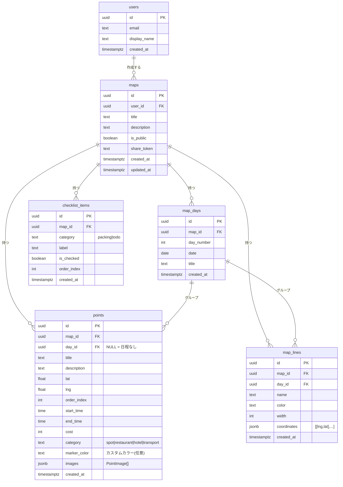

# Viamaps 要件定義書

Google マイマップ × tabiori の機能を持つ旅行地図サービス

2026年5月 / Version 2.0

---

## 1. 機能要件

### 1.1 認証・ユーザー管理

| # | 機能 | 説明 | 状態 |
|---|------|------|------|
| F-01 | メール認証 | メールアドレス＋パスワードで登録・ログイン | ✅ |
| F-02 | Google ログイン | Google アカウントで OAuth ログイン（常時有効） | ✅ |
| F-03 | ゲスト利用 | 未ログインでもマップ閲覧可（公開マップのみ） | ✅ |
| F-04 | セッション管理 | Supabase JWT を httpOnly cookie で管理・自動更新 | ✅ |
| F-05 | パスワードリセット | メールでパスワードリセットリンクを送信 | ✅ |

### 1.2 マップ管理

| # | 機能 | 説明 | 状態 |
|---|------|------|------|
| F-10 | マップ作成 | タイトル・説明でマップを作成 | ✅ |
| F-11 | マップ一覧 | カードグリッド表示（ポイント数・更新日・公開バッジ） | ✅ |
| F-12 | マップ編集 | タイトル・説明・公開設定を変更（pre-populated） | ✅ |
| F-13 | マップ削除 | マップとすべての関連データを削除 | ✅ |
| F-14 | 公開設定 | is_public を ON にするとリンクで誰でも閲覧可 | ✅ |
| F-15 | 共有リンク | share_token 付き URL を発行。ログイン不要で閲覧可 | ✅ |
| F-16 | iframe 埋め込み | 設定ページで埋め込みコードを生成・コピー | ✅ |

### 1.3 日程管理（tabiori 相当）

| # | 機能 | 説明 | 状態 |
|---|------|------|------|
| F-20 | 日程追加 | Day 1・Day 2…と日程を追加（map_days テーブル） | ✅ |
| F-21 | 日程タイトル設定 | 日程名をインライン編集 | ✅ |
| F-22 | 日程日付設定 | 各日程に日付（DATE）を設定 | ✅ |
| F-23 | 日程削除 | 日程を削除（配下のポイントは「日程なし」に） | ✅ |
| F-24 | 日程折りたたみ | 日程ヘッダーのクリックで展開・折りたたみ | ✅ |
| F-25 | 日程カラー | Day 1→青、Day 2→緑…8色サイクルで自動割り当て | ✅ |

### 1.4 ポイント管理

| # | 機能 | 説明 | 状態 |
|---|------|------|------|
| F-30 | ポイント追加 | 地図クリック / 場所検索 でポイントを追加 | ✅ |
| F-31 | ポイント編集 | タイトル・説明・画像・日程・時刻・費用・カテゴリを変更 | ✅ |
| F-32 | ポイント削除 | ポイントを削除 | ✅ |
| F-33 | ポイント並び替え | ▲▼ボタンでポイントの表示順を変更 | ✅ |
| F-34 | 日程割り当て | ポイントを任意の日程に割り当て | ✅ |
| F-35 | 時刻設定 | 開始時刻・終了時刻を設定 | ✅ |
| F-36 | 費用設定 | ポイントごとに費用（円）を記録 | ✅ |
| F-37 | カテゴリ分類 | スポット / グルメ / ホテル / 移動 から選択 | ✅ |
| F-38 | カスタムマーカーカラー | 10色のパレットから個別に色を設定 | ✅ |
| F-39 | 画像追加 | 複数の画像URLを登録。キャプション付き | ✅ |

### 1.5 マップエディタ（地図 UI）

| # | 機能 | 説明 | 状態 |
|---|------|------|------|
| F-40 | Mapbox 地図表示 | 地図 / 衛星 / 地形の3スタイル切替 | ✅ |
| F-41 | クリックでポイント追加 | 地図クリック → 緑ピン表示 → 詳細入力パネル | ✅ |
| F-42 | 場所検索（Geocoding） | Mapbox Geocoding API でインクリメンタル検索 → 地図移動 + ピン | ✅ |
| F-43 | マーカークリック | 既存ポイントのマーカークリックで編集パネル | ✅ |
| F-44 | ホバーポップアップ | マーカーにhoverで時刻・費用・説明のInfoWindow | ✅ |
| F-45 | flyTo | マーカー選択で地図がアニメーション移動 | ✅ |
| F-46 | 日程別サイドバー | 日程ごとにポイントをグループ表示（折りたたみ可） | ✅ |
| F-47 | ナビゲーションコントロール | ズームイン・ズームアウト・コンパス | ✅ |

### 1.6 ルート・地図分析（Google マイマップ相当）

| # | 機能 | 説明 | 状態 |
|---|------|------|------|
| F-50 | 道路ルート表示 | Mapbox Directions API による実際の道路に沿ったルート線 | ✅ |
| F-51 | 距離・所要時間表示 | 日程ヘッダーに「🚗 12.3km · 45分」を自動表示 | ✅ |
| F-52 | 日程別カラールート | 各日程のルート線を対応カラーで描画 | ✅ |
| F-53 | フォールバック直線 | Directions API 失敗時は破線の直線ルートにフォールバック | ✅ |
| F-54 | 描画ツール | ✏️ライン描画モードで地図上に手動ラインを描画 | ✅ |
| F-55 | ライン色・名前設定 | 描画ラインに色（6色）と名前を設定 | ✅ |
| F-56 | ライン削除 | 描画ラインをサイドバーから削除 | ✅ |

### 1.7 チェックリスト（tabiori 相当）

| # | 機能 | 説明 | 状態 |
|---|------|------|------|
| F-60 | 持ち物リスト | カテゴリ「packing」のチェックリスト | ✅ |
| F-61 | やることリスト | カテゴリ「todo」のチェックリスト | ✅ |
| F-62 | アイテム追加 | ラベルを入力して追加 | ✅ |
| F-63 | チェック ON/OFF | クリックで完了状態を切替 | ✅ |
| F-64 | アイテム削除 | 不要なアイテムを削除 | ✅ |

### 1.8 ビューアモード（コア差別化機能）

| # | 機能 | 説明 | 状態 |
|---|------|------|------|
| F-70 | デスクトップ左パネル | 日程グループ別ポイント一覧 + 選択中の詳細 | ✅ |
| F-71 | ← → ナビゲーション | ボタンで前後ポイントに flyTo アニメーション | ✅ |
| F-72 | 日程別カラーマーカー | ビューアでも日程カラーでマーカー表示 | ✅ |
| F-73 | ルート線表示 | ビューアでも Directions ルートを表示 | ✅ |
| F-74 | 画像スライダー | 複数画像を ‹ › でスライド | ✅ |
| F-75 | モバイル対応 | モバイルは地図上・情報下のレイアウト | ✅ |
| F-76 | 編集リンク | オーナーには「✏️ 編集」リンクを表示 | ✅ |

---

## 2. 非機能要件

### 2.1 性能

| 項目 | 要件 |
|------|------|
| 地図表示（初回ロード） | 3秒以内 |
| flyTo アニメーション | 1.5秒以内 |
| ポイント追加レスポンス | 1秒以内 |
| Directions API レスポンス | 2秒以内（非同期・バックグラウンド） |
| 場所検索（Geocoding） | デバウンス 400ms 後に取得 |

### 2.2 可用性

| 項目 | 要件 |
|------|------|
| 月次稼働率 | 99%以上 |
| クリティカル障害検知 | Sentry からメール通知 |
| バックアップ | Supabase 自動バックアップ |

### 2.3 セキュリティ

| 項目 | 要件 |
|------|------|
| 通信 | HTTPS 必須 |
| 認証方式 | Supabase Auth（JWT + httpOnly cookie） |
| DB 保護 | Supabase RLS（全テーブル適用） |
| セキュリティヘッダー | X-Frame-Options: DENY、X-Content-Type-Options: nosniff |

---

## 3. 画面一覧

| ページ | URL | 説明 | 認証 |
|--------|-----|------|------|
| トップ | `/` | サービス説明・マップ作成CTA | 不要 |
| ログイン | `/auth/login` | メール/パスワード + Google OAuth | 不要 |
| 新規登録 | `/auth/register` | Google OAuth 優先 + メール登録 | 不要 |
| パスワードリセット | `/auth/reset-password` | パスワードリセット | 不要 |
| OAuthコールバック | `/auth/callback` | OAuth認証後のリダイレクト先 | 不要 |
| マイマップ | `/maps` | カードグリッドのマップ一覧 | 要 |
| マップ作成 | `/maps/new` | 新規マップ作成フォーム | 要 |
| マップエディタ | `/maps/[id]` | 日程・ポイント追加・描画ツール | 要（オーナー） |
| マップ設定 | `/maps/[id]/settings` | タイトル・公開設定・埋め込みコード | 要（オーナー） |
| チェックリスト | `/maps/[id]/checklist` | 持ち物・やることリスト | 要（オーナー） |
| ビューアモード | `/maps/[id]/view` | スムーズナビゲーション体験 | 任意 |
| 共有マップ | `/shared/[token]` | 公開リンクからの閲覧 | 不要 |
| 設定 | `/settings` | アカウント設定 | 要 |
| 利用規約 | `/terms` | 利用規約 | 不要 |
| プライバシー | `/privacy` | プライバシーポリシー | 不要 |

---

## 4. データモデル（ER図）



### 型定義

```typescript
interface PointImage { url: string; caption: string | null; }

// DAY_COLORS[dayNumber-1 % 8] で日程カラーを取得
const DAY_COLORS = ['#3B82F6','#10B981','#F59E0B','#8B5CF6','#EF4444','#06B6D4','#F97316','#EC4899'];
```

---

## 5. RLS ポリシー

### maps テーブル
| ポリシー | 条件 |
|---------|------|
| オーナー全操作 | `auth.uid() = user_id` |
| 公開マップ読み取り | `is_public = true` |

### map_days / points / map_lines / checklist_items テーブル
| ポリシー | 条件 |
|---------|------|
| オーナー全操作 | `EXISTS (SELECT 1 FROM maps WHERE maps.id = {table}.map_id AND maps.user_id = auth.uid())` |
| 公開マップ読み取り | `EXISTS (SELECT 1 FROM maps WHERE maps.id = {table}.map_id AND maps.is_public = true)` |

---

## 6. 環境変数

| 変数 | 説明 | 公開 |
|------|------|------|
| `NEXT_PUBLIC_SUPABASE_URL` | Supabase プロジェクト URL | ✅ |
| `NEXT_PUBLIC_SUPABASE_ANON_KEY` | Supabase 匿名キー | ✅ |
| `SUPABASE_SERVICE_ROLE_KEY` | Supabase サービスロールキー | ❌ |
| `NEXT_PUBLIC_MAPBOX_TOKEN` | Mapbox アクセストークン（Geocoding・Directions・地図タイル） | ✅ |
| `NEXT_PUBLIC_APP_URL` | アプリ URL（OGP・OAuth リダイレクト用） | ✅ |
